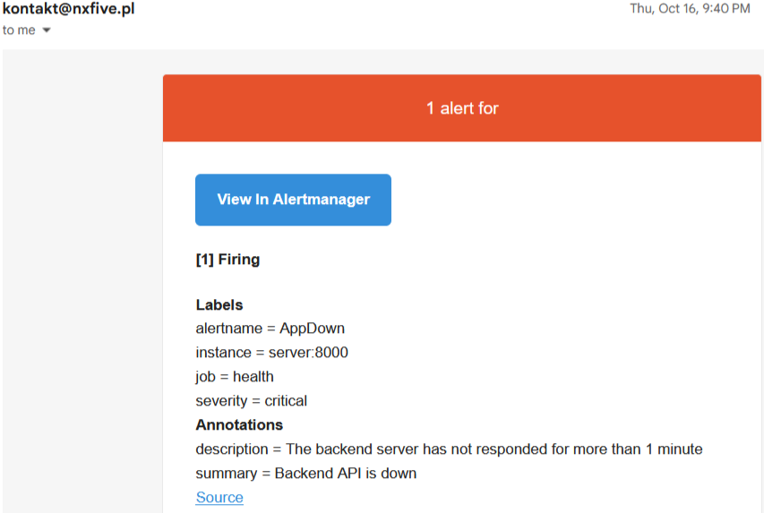
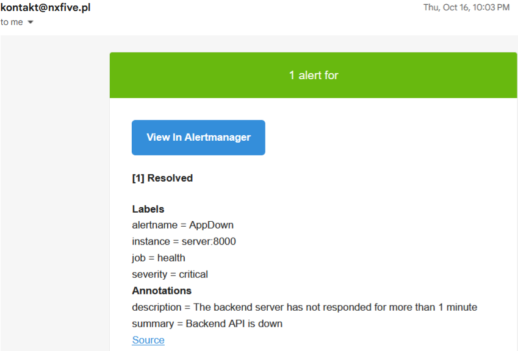

# 🚀 Production-Ready Bank Anomaly Detection System <br>(Anomaly Models + FastAPI + Streamlit + Monitoring + Logging)

This project demonstrates how to design and implement a production-ready anomaly detection system for bank transactions, covering the full lifecycle — from data preprocessing and feature engineering, through model execution and orchestration, to serving, monitoring, and observability.

The system focuses on unsupervised fraud detection using **Isolation Forest** and **Local Outlier Factor**.

[](https://www.kaggle.com/code/nxfiv3/anomaly-detection-bank-transactions-nxfiv3)


## 🎯 Project Goal

The goal of this project was to build a clean, extensible, and production-oriented anomaly detection pipeline, where:

- Feature engineering is explicit and designed to be data-leakage safe
- Model execution is generic and configuration-driven
- Orchestration logic is kept separate from model implementations
- Serving, monitoring, and logging are part of the core system


## 🌊 Project Flow

The system is organized into explicit pipelines, each responsible for one part of the anomaly detection lifecycle.

1️⃣ Data Ingestion & Transformation

- Raw transaction data is loaded from the source
- Initial data transformations are applied
- A clean input for feature engineering is prepared for feature engineering


2️⃣ Feature Engineering Pipeline

🔹 Core Feature Processing

Applied to the full dataset before splitting:

- Feature extraction is performed
- Feature transformation is applied
- Features without data leakage risk are created

🔹 Post-Split Feature Engineering

After train/test split:

- Rolling features are added
- Group-based features are added
- Unusual usage detection features are created
- Time since last transaction features are computed


3️⃣ Model Execution Pipeline (Anomaly Detection)

🔹 Generic Model Orchestration

- Model-specific features are prepared
- Parameters are loaded from configuration (config.yml)
- Only required dependencies are injected into the model


4️⃣ Ensemble Logic (Consensus Fraud Detection)

After model execution:

- Predictions from Isolation Forest and Local Outlier Factor are merged
- A transaction is marked as suspicious only if both models agree


🌐 Serving Layer

🔹 FastAPI Backend

- Prediction endpoints are exposed
- Available models can be queried
- Single-model or combined inference is supported


🔹 Streamlit Frontend

- An interactive UI for transaction input is provided
- Real-time anomaly checks are performed
- Model decisions are presented transparently


---

## 📊 Monitoring

- Metrics collection with Prometheus
- Dashboards and visualizations with Grafana
- Alerts and notifications with Alertmanager

---

## 📝 Logging

- Log collection with Filebeat
- Centralized storage and search with Elasticsearch
- Visualization and analysis with Kibana
- Automatic log rotation with logrotate

---

## 🔒 Security

- **Basic Authentication:** Access to Grafana is protected with basic authentication. 
- **Isolated Docker Network:** Kibana, Elasticsearch, and Filebeat run on a separate Docker network and communicate securely using TLS certificates.  
- **Firewall Restrictions:** The server firewall only allows external traffic to the main application, Kibana, and Grafana. All other ports are blocked.  
- **Custom SSH Port:** SSH access is configured on a non-default port to reduce automated attacks.  
- **Rate Limiting:** Rate limits are applied to protect services from abuse or brute-force attempts.  

---

## 🛠️ Tech Stack

- **Backend:** FastAPI, Numpy, Pandas, Scikit-learn
- **Frontend:** Streamlit
- **Testing:** Pytest
- **Deployment:** Docker, Azure DevOps, Traefik
- **Monitoring:** Prometheus, Grafana, Alertmanager
- **Logging:** Elasticsearch, Filebeat, Kibana, Logrotate

---

## 🖥️ System Architecture


                                ┌───────────────┐
                                │    Client     │
                                └───────┬───────┘
                                        │ [HTTPS + firewall]
                                        ▼
                               ┌─────────────────────┐
                               │       Traefik       │
                               │   (Reverse Proxy)   │
                               │                     │
                               └──────────┬──────────┘
                                          │ [HTTP]
                                          ▼
                        ┌───────────────────┬──────────────────────┐
                   [Basic Auth]             │                      │
                        ▼                   ▼                      ▼              
                   ┌─────────────┐      ┌─────────────┐      ┌────────────┐  
                   │  Grafana    │      │   Kibana    │      │  App UI    │  
                   │             │      │             │      │            │
                   └───────┬─────┘      └──────┬──────┘      └──────┬─────┘  
                           │                   │                    │
                           │[HTTP]           [HTTPS]                │ [HTTP]
                           ▼                   ▼                    │      
                    ┌─────────────┐     ┌──────────────┐            │
                    │ Prometheus  │     │Elasticsearch │            │
                    │             │     │              │            │
                    └───┬──────┬──┘     └──────────────┘            │
                  [HTTP]│      │               ▲                    │
                        ▼      │[HTTP]       [HTTPS]                │
             ┌──────────────┐  │               │                    │
             │ Alertmanager │  │        ┌─────────────┐             │
             │              │  │        │  Filebeat   │             │
             └──────────────┘  │        │             │             │
                               │        └──────┬──────┘             │
                               │             [HTTP]                 │
                               ▼               ▼                    ▼
                               └───────────────┴────────────────────┘
                                               ▼
                                        ┌─────────────┐
                                        │   Server    |
                                        │  (backend)  |
                                        └─────────────┘


## ⚡ Quick Start
#### 1. Clone the repository
```bash
git clone https://github.com/nxfive/ml-bank-anomaly-detection.git
cd ml-bank-anomaly-detection
```

#### 2. Install uv & sync dependencies
```bash
pip install uv
uv sync
```

#### 3. Build
```bash
bash ./scripts/build.sh
```

#### 4. Test
```bash
bash ./scripts/test.sh
```

#### 5. Start FastAPI backend
```bash
bash ./scripts/server.sh
```

* Swagger UI: http://127.0.0.1:8000/docs
* Redoc UI: http://127.0.0.1:8000/redoc

#### 6. Start Streamlit frontend
```bash
bash ./scripts/client.sh
```
---
### Run project
```
bash ./run.sh
```
---
### Run with Docker
```bash
docker-compose -f docker-compose.yml up --build
```


## 📸 Screenshots

### Dashboard


### Grafana Metrics

### Kibana Logs

### Logrotate

### Alert Manager - Firing

### Alert Manager - Resolved

### Test Coverage
