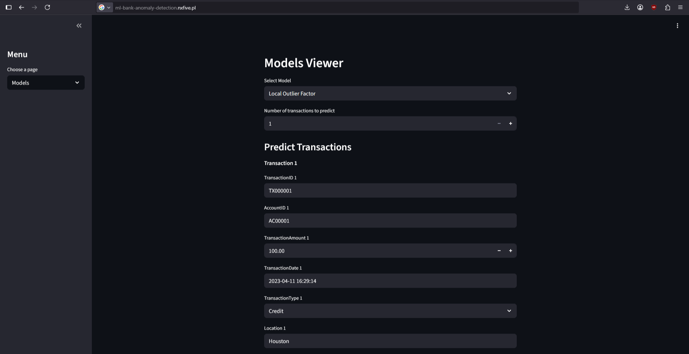
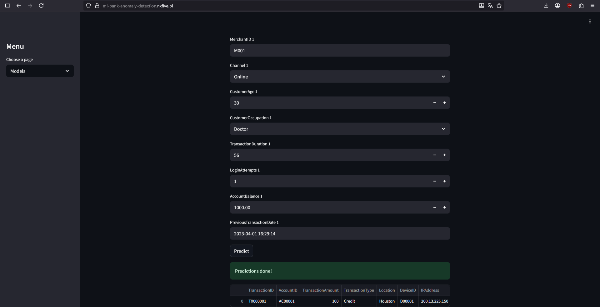
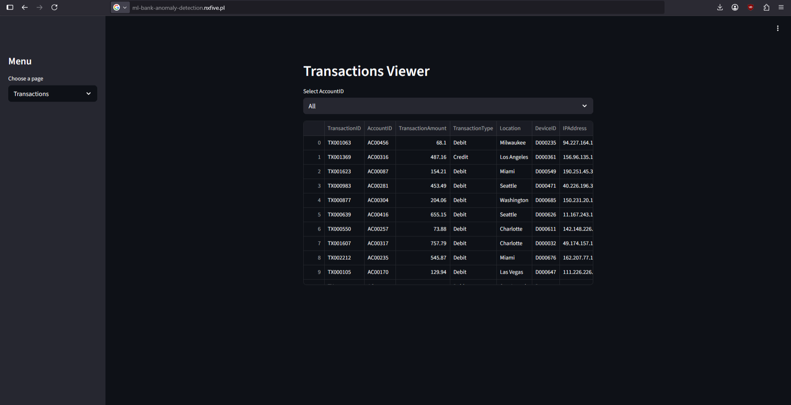
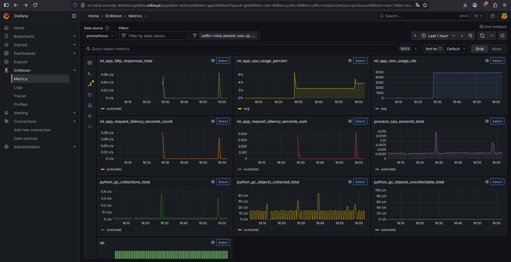
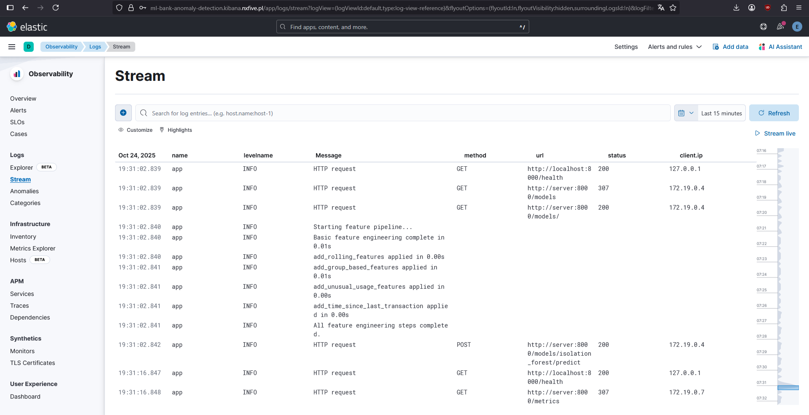
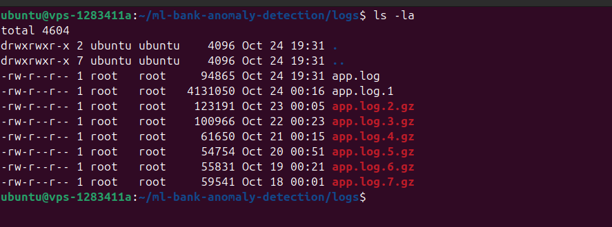
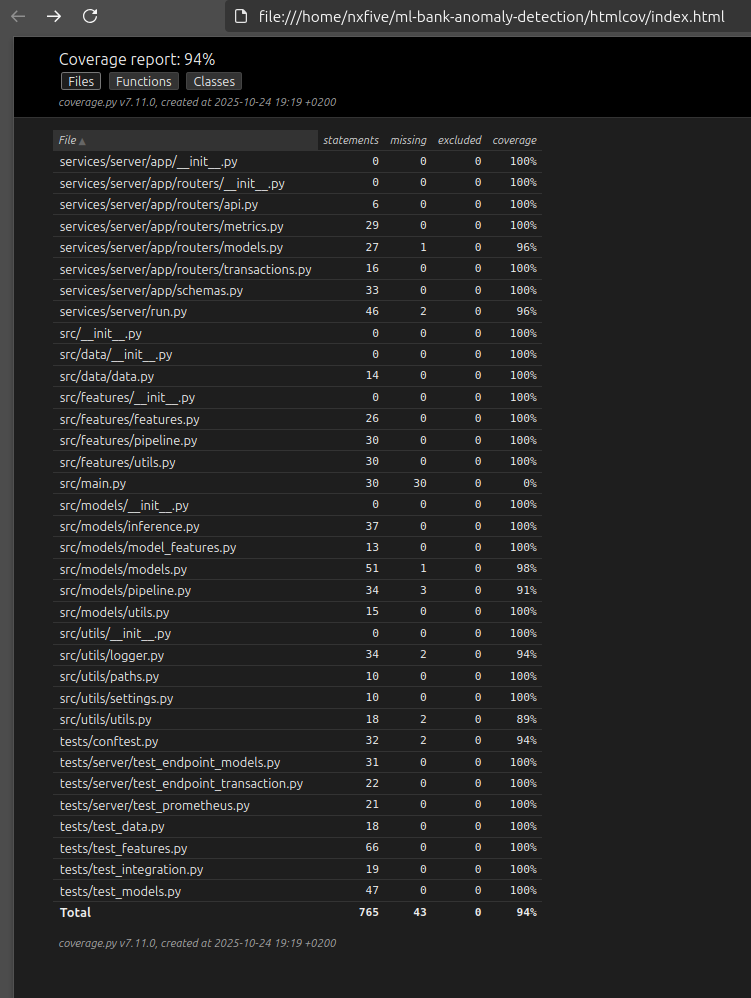

# Bank Anomaly Detection 

Detect suspicious bank transactions using Isolation Forest and Local Outlier Factor models.<br> 
Includes a **FastAPI backend** for prediction and a **Streamlit frontend** for interactive UI.

[](https://www.kaggle.com/code/nxfiv3/anomaly-detection-bank-transactions-nxfiv3)

---
## Features

- View available models and transactions via API
- Predict transactions using a single model or both models simultaneously
- Interactive Streamlit interface for entering transaction data and checking for fraud
- Data preprocessing and feature engineering steps included
- Tested with Pytest (API endpoints + core /src modules)

---

## Monitoring

- Metrics collection with Prometheus
- Dashboards and visualizations with Grafana
- Alerts and notifications with Alertmanager

---

## Logging

- Log collection with Filebeat
- Centralized storage and search with Elasticsearch
- Visualization and analysis with Kibana
- Automatic log rotation with logrotate

---

## Security

- **Basic Authentication:** Access to Grafana is protected with basic authentication. 
- **Isolated Docker Network:** Kibana, Elasticsearch, and Filebeat run on a separate Docker network and communicate securely using TLS certificates.  
- **Firewall Restrictions:** The server firewall only allows external traffic to the main application, Kibana, and Grafana. All other ports are blocked.  
- **Custom SSH Port:** SSH access is configured on a non-default port to reduce automated attacks.  
- **Rate Limiting:** Rate limits are applied to protect services from abuse or brute-force attempts.  

---

## Tech Stack

- **Backend:** FastAPI, Numpy, Pandas, Scikit-learn
- **Frontend:** Streamlit
- **Testing:** Pytest
- **Deployment:** Docker, Azure DevOps, Traefik
- **Monitoring:** Prometheus, Grafana, Alertmanager
- **Logging:** Elasticsearch, Filebeat, Kibana, Logrotate

---

## System Architecture


                                ┌───────────────┐
                                │   Client      │
                                └───────┬───────┘
                                        │ [HTTPS + firewall]
                                        ▼
                              ┌─────────────────────┐
                              │     Traefik         │
                              │ (Reverse Proxy)     │
                              │                     │
                              └──────────┬──────────┘
                                         │ [HTTP]
                                         ▼
                        ┌───────────────────┬───────────────────────┐
                   [Basic Auth]             │                       │
                        ▼                   ▼                       ▼              
                   ┌─────────────┐   ┌─────────────┐         ┌─────────────┐  
                   │  Grafana    │   │   Kibana    │         │  App UI     │  
                   │             │   │             │         │             │
                   └─────────────┘   └─────────────┘         └─────────────┘  
                           │                   │                     │
                           │[HTTP]           [HTTPS]                 │ [HTTP]
                           ▼                   ▼                     │      
    ┌─────────────┐      ┌─────────────┐   ┌──────────────┐          │
    │Alertmanager │[HTTP]│ Prometheus  │   │Elasticsearch │          │
    │             │ ◀─   │             │   │              │          │
    └─────────────┘      └─────────────┘   └──────────────┘          │
                             │                   ▲                   │
                             │[HTTP]           [HTTPS]               │
                             │                   │                   │
                             │          ┌─────────────┐              │
                             │          │  Filebeat   │              │
                             │          │             │              │
                             │          └─────────────┘              │
                             │                │[HTTP]                │
                             ▼                ▼                      ▼
                             ┴────────────────┴──────────────────────┴
                                              ▼
                                       ┌─────────────┐
                                       │   Server    |
                                       │ (backend)   |
                                       │             │
                                       └─────────────┘


## Quick Start
#### 1. Clone the repository
```bash
git clone https://github.com/nxfive/ml-bank-anomaly-detection.git
cd ml-bank-anomaly-detection
```

#### 2. Install uv & sync dependencies
```bash
pip install uv
uv sync
```

#### 3. Build
```bash
bash ./scripts/build.sh
```

#### 4. Test
```bash
bash ./scripts/test.sh
```

#### 5. Start FastAPI backend
```bash
bash ./scripts/server.sh
```

* Swagger UI: http://127.0.0.1:8000/docs
* Redoc UI: http://127.0.0.1:8000/redoc

#### 6. Start Streamlit frontend
```bash
bash ./scripts/client.sh
```
---
### Run project
```
bash ./run.sh
```
---
### Run with Docker
```bash
docker-compose -f docker-compose.yml up --build
```


## Screenshots

### Dashboard




### Grafana Metrics

### Kibana Logs

### Logrotate

### Test Coverage
